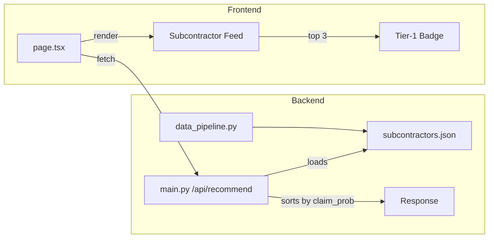

# Shepherd Engine: Backend + Frontend SaaS Dashboard

## Current State

- **Backend**: Has `venv` with FastAPI and pandas installed; no `main.py` or `data_pipeline.py` yet
- **Frontend**: Next.js 16 + Tailwind v4 at `[frontend/app/page.tsx](frontend/app/page.tsx)`; default starter template
- **Styling**: User rule requires all styles in `globals.css` (no inline styling)

**Note**: The frontend lives at `frontend/app/`, not `frontend/src/app/`.

---

## 1. Backend: Data Pipeline

**File**: `[backend/data_pipeline.py](backend/data_pipeline.py)`

- Use `random` and `json` (stdlib) to generate 100 subcontractors
- Each record: `{ "name": str, "headcount": int, "osha_violations": int }`
- Names: e.g. "ABC Construction", "Smith & Sons Electric", etc. (randomized)
- Headcount: 5–500
- OSHA violations: 0–25
- Write to `backend/subcontractors.json` (or project root; clarify in implementation)

---

## 2. Backend: FastAPI Server

**File**: `[backend/main.py](backend/main.py)`

- FastAPI app with CORS middleware for `http://localhost:3000` (Next.js dev)
- **GET `/api/recommend`**:
  - Load `subcontractors.json` from disk
  - Compute mock claim probability per subcontractor, e.g.:
    - `claim_probability = min(1.0, (osha_violations * 0.08) - (headcount * 0.0005) + 0.15)`
    - Lower = better recommendation
  - Sort by ascending `claim_probability` (best first)
  - Return JSON: `{ "subcontractors": [...] }` with each item including `claim_probability`

**File**: `[backend/requirements.txt](backend/requirements.txt)` (create if missing)

- `fastapi`, `uvicorn`, `pandas` (optional; can use stdlib only for this scope)

---

## 3. Frontend: Theme Variables in globals.css

**File**: `[frontend/app/globals.css](frontend/app/globals.css)`

Define CSS custom properties for light/dark themes:

```css
/* Light theme (default) */
:root {
  --bg: #FAFAFA;
  --box: #FFFFFF;
  --border: #E7E7E7;
  --text-primary: #081C32;
  --text-secondary: #9CA5AD;
  --accent: #344DDE;
  --header-size: 30px;
  --subheader-size: 18px;
  --font-weight: 500;
}

/* Dark theme */
@media (prefers-color-scheme: dark) {
  :root {
    --bg: #0A0A0A;
    --box: transparent;
    --border: #242424;
    --text-primary: #E8E7EC;
    --text-secondary: #D1D0D5;
    --accent: #94A1FF;
  }
}
```

Add classes for dashboard layout, cards, badges, callouts, etc. (no inline styles).

---

## 4. Frontend: SaaS Dashboard Page

**File**: `[frontend/app/page.tsx](frontend/app/page.tsx)`

- **Client component** (`"use client"`) for `fetch`
- Fetch `http://localhost:8000/api/recommend` on mount
- Handle loading and error states
- Render:
  - Header: "Subcontractor Recommendations"
  - Sub-header: "Ranked by claim probability"
  - Feed of subcontractor cards (use CSS classes from globals.css)
- **Top 3 cards**:
  - Green "Shepherd Tier-1 Verified" badge
  - Callout: "Premium discount available"
- Each card: name, headcount, osha_violations, claim probability (formatted %)
- Layout: responsive grid/list

**File**: `[frontend/app/layout.tsx](frontend/app/layout.tsx)`

- Add `suppressHydrationWarning` on `<html>` if using theme detection
- Update metadata: title "Shepherd Engine", description for dashboard

---

## 5. Run Order

1. `cd backend && python data_pipeline.py` — generates `subcontractors.json`
2. `cd backend && uvicorn main:app --reload` — API on port 8000
3. `cd frontend && npm run dev` — Next.js on port 3000

---

## Data Flow




---

## File Summary


| Action | Path                       |
| ------ | -------------------------- |
| Create | `backend/data_pipeline.py` |
| Create | `backend/main.py`          |
| Create | `backend/requirements.txt` |
| Update | `frontend/app/globals.css` |
| Update | `frontend/app/page.tsx`    |
| Update | `frontend/app/layout.tsx`  |


